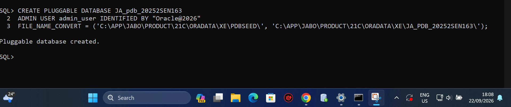
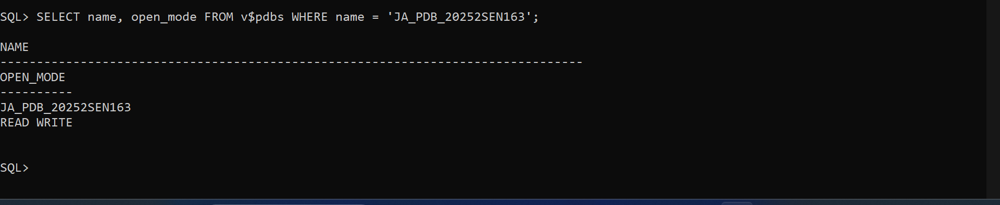
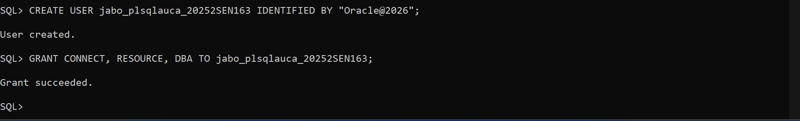
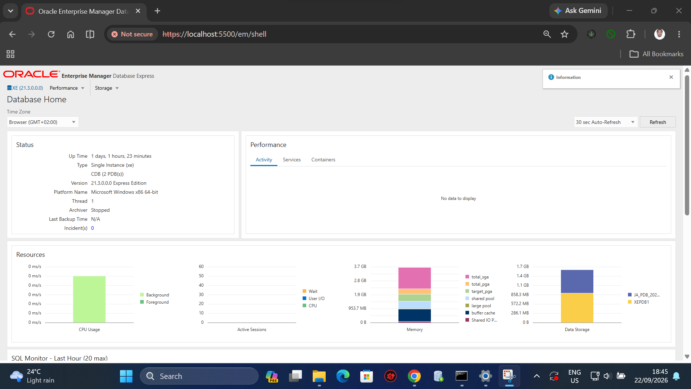

# Oracle PDB Assignment II

**Student Identifier:** `20252SEN163_JABO Ghislain`  
**Course:** Database development with PL/SQL

---

## Overview

This repository contains the setup, administration, and configuration tasks for Oracle Pluggable Databases (PDBs) as required for **Assignment II**. It details the step-by-step creation of a pluggable database, setting its operational state, and configuring dedicated user accounts and schema access.

---

## Requirements & Setup Steps

### 1. Pluggable Database Creation
- Executed SQL commands to create a new Pluggable Database (`PDB`) within the Container Database (`CDB`).
- Allocated administrative credentials and file storage paths for the PDB components.

### 2. PDB State Management
- Initialized and altered the PDB status to `OPEN` (Read/Write) to allow connections and data operations.
- Verified the pluggable database state using `SHOW PDBS` and `v$pdbs` queries.

### 3. User & Privilege Management
- Created dedicated PDB user accounts with appropriate tablespace quotas.
- Granted necessary system privileges (`CREATE SESSION`, `CREATE TABLE`, `RESOURCE`, etc.) to facilitate database interactions.

---

## Execution Screenshots

All verification images are stored under the `screenshots/` directory:

### 1. PDB Creation
Command execution for creating the Pluggable Database:

---

### 2. Opening the PDB
Altering and verifying the open state of the PDB:

---

### 3. User Creation & Privileges
Creating the PDB user account and assigning privileges:

---

### 4. OEM Dashboard Overview
Oracle Enterprise Manager (OEM) Dashboard displaying database health and performance:

---

